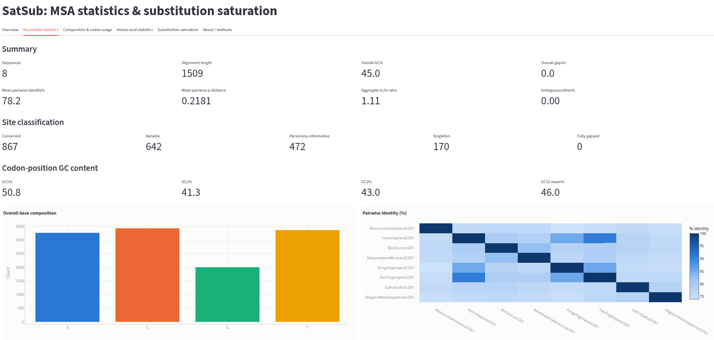
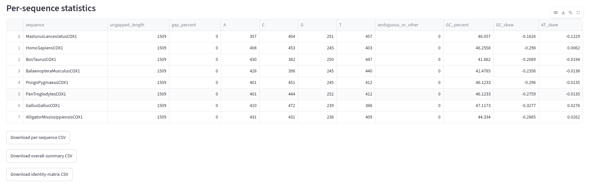
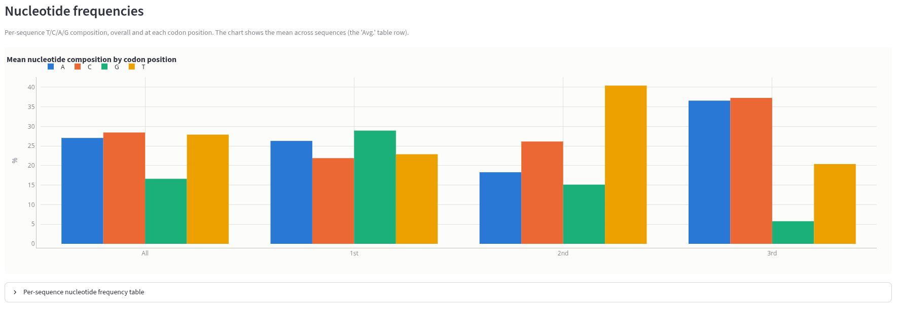
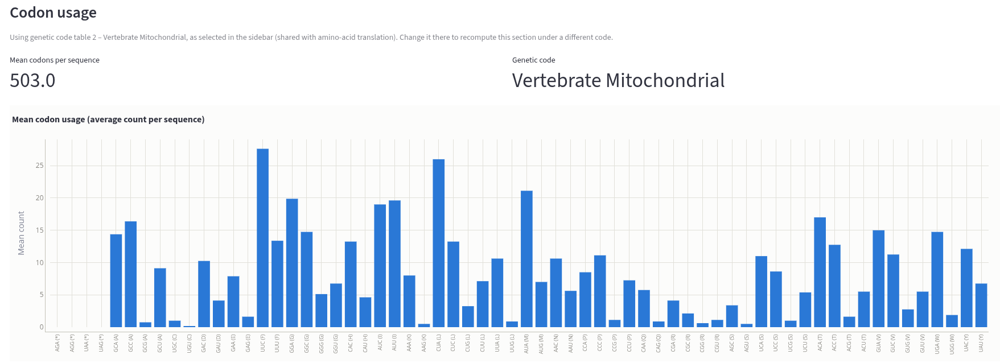
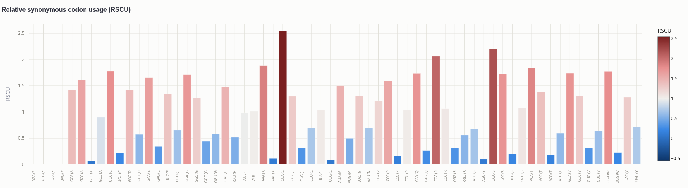
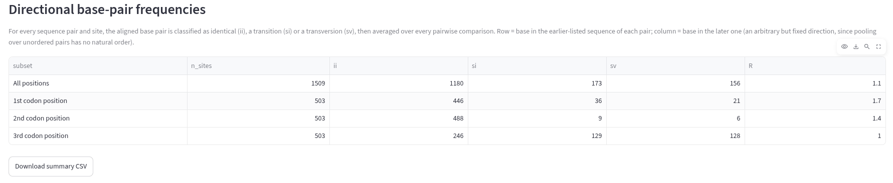
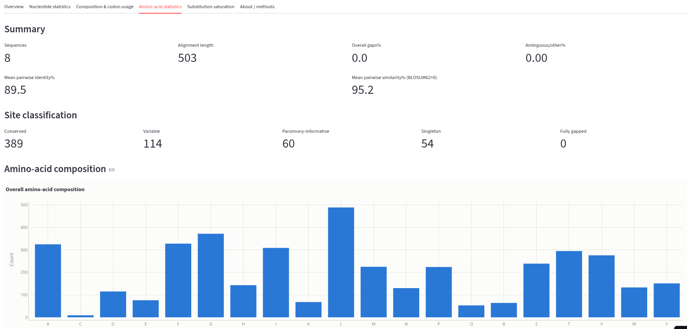
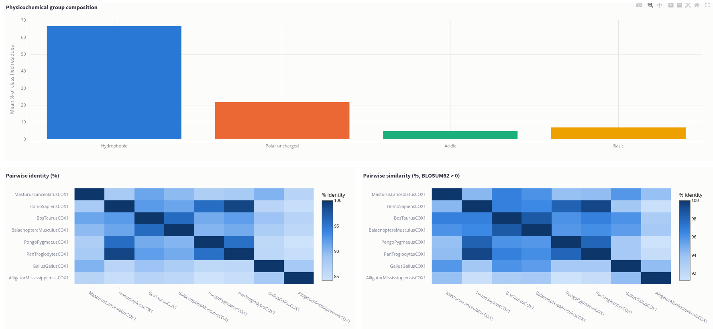
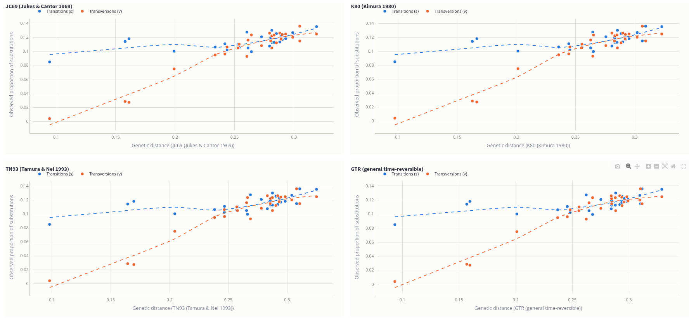

# SatSub Tutorial: Alignment Statistics and Substitution Saturation

This tutorial walks you through SatSub using the dataset it ships with:
eight vertebrate cytochrome oxidase I (COI / COX1) barcoding sequences.
By the end, you will be able to load an alignment, read every statistics
panel SatSub produces, and — the main event — recognize substitution
saturation when you see it in a real dataset.

No programming is required. Everything here happens by clicking through
the browser interface.

## What you will learn

- How to launch SatSub and load the bundled example alignment
- How to read nucleotide and amino-acid alignment statistics
- How codon usage and RSCU reveal codon bias
- What substitution saturation is, why it matters for building
  phylogenetic trees, and how to spot it in a saturation plot
- How to export any table as a CSV for further analysis

## Prerequisites

- SatSub installed (see `readme.md` for setup with `uv` or `pip`)
- A terminal to launch the app; everything after that is point-and-click

```bash
.venv/bin/satsub-gui
# or, from the repo root:
.venv/bin/streamlit run satsub/app.py
```

This opens SatSub in your browser, usually at `http://localhost:8501`.

---

You can also use SatSub in the following link: [SatSub](https://satsub.streamlit.app/)

## 1. Load the example dataset

In the sidebar, under **1. Nucleotide alignment**, select
**"Use bundled example (Vertebrate COI, 8 taxa)"**.

This loads `VertCOI.fas`: eight complete COI gene sequences (1,509
nucleotides each, no gaps — the sequences happen to align without
indels), one per species:

| Species | Common group |
|---|---|
| *Masturus lanceolatus* | Ocean sunfish (bony fish) |
| *Homo sapiens* | Human |
| *Bos taurus* | Cattle |
| *Balaenoptera musculus* | Blue whale |
| *Pongo pygmaeus* | Orangutan |
| *Pan troglodytes* | Chimpanzee |
| *Gallus gallus* | Chicken |
| *Alligator mississippiensis* | American alligator |

This is a good teaching dataset precisely because it is evolutionarily
lopsided: five mammals that are fairly close to each other, plus a bird,
a reptile, and a fish that are each very distant from the mammals and
from one another. That spread is exactly what makes saturation visible
later in this tutorial — a set of only closely related sequences would
not show it.

The file uses the RNA alphabet (U instead of T); SatSub detects this
automatically and normalizes it internally, which is why you will see
T, not U, everywhere in the statistics. The **Overview** tab confirms
what was loaded: format, sequence count, alignment length, and this
RNA note.

---

## 2. Nucleotide statistics tab

Open the **Nucleotide statistics** tab. This is the "know your data"
tab — read it before trusting any downstream analysis.



**Summary row.** For this dataset you should see 8 sequences, an
alignment length of 1,509, an overall GC content around **45%**, and
0% gaps (these sequences happen to be gap-free). Mean pairwise identity
sits around **78%** and the mean pairwise p-distance (raw proportion of
differing sites) around **0.22** — a reminder that this alignment spans
a wide range of divergence, from human/chimpanzee (barely 2–3% apart)
to fish/mammal (well over 50% apart).

**Site classification.** Of the 1,509 sites, about 867 are conserved
(identical across all eight taxa), 642 are variable, and 472 of those
are parsimony-informative (useful for building a tree by parsimony).
The gap between "variable" and "parsimony-informative" (the singleton
sites) tells you how much of the variation is unique to one sequence
versus shared, phylogenetically useful variation.

**Base composition chart and identity heatmap.** The bar chart shows
overall A/C/G/T counts pooled across all sequences. The heatmap is more
informative for spotting structure at a glance: look for the block of
high identity among the five mammals versus the much darker cells
wherever the fish, bird, or reptile is being compared — that visual
pattern is the same evolutionary spread mentioned above, just easier to
see.

**Per-sequence table.** Every statistic above, broken out per sequence,
with a CSV download button if you want to take it further in a
spreadsheet or R/Python.



---

## 3. Composition & codon usage tab

This tab is specific to nucleotide alignments and dives into
codon-level structure — only meaningful because COI is a protein-coding
gene.

### Nucleotide frequencies by codon position



Look at the grouped bar chart: GC content is not the same at every
codon position. In this dataset, GC1 (1st position) is around **51%**,
GC2 (2nd position) drops to about **41%**, and GC3 (3rd position) sits
around **43%**. This is a classic and very teachable pattern: the 3rd
codon position is mostly "wobble" — synonymous substitutions there
rarely change the amino acid, so it evolves under much weaker selective
constraint and its base composition drifts more freely than positions
1 and 2, which more often change the encoded amino acid and are kept
in check by selection.


### Codon usage and RSCU



Set the **genetic code table** in the sidebar to **2 — Vertebrate
Mitochondrial**. This matters: COI is a mitochondrial gene, and the
vertebrate mitochondrial code reassigns a few codons compared to the
standard nuclear code (most visibly, UGA codes for tryptophan instead
of being a stop codon, and AGA/AGG are stop codons instead of arginine).
Pick the wrong table here and the amino-acid statistics and codon usage
table will both be subtly wrong.

With table 2 selected, the codon usage bar chart shows the mean number
of times each codon is used per sequence (about 503 codons per
sequence, since 1,509 ÷ 3 = 503). The RSCU chart is more interesting:
RSCU (relative synonymous codon usage) compares each codon's usage to
what you would expect if every codon for the same amino acid were used
equally. A value of 1.0 (the dotted reference line) means "used exactly
as often as expected"; the diverging blue-to-red coloring makes
over-used codons (RSCU > 1, redder) and under-used codons (RSCU < 1,
bluer) easy to spot at a glance. For example, in this dataset UUU
(Phe) has an RSCU of about 0.65 while its synonym UUC has about 1.35 —
these sequences consistently prefer UUC over UUU, a real and typical
codon-usage bias, not a fluke of one sequence.



### Directional base-pair frequencies



The summary table breaks every pairwise sequence comparison into
identical (**ii**), transition (**si**), and transversion (**sv**)
counts, averaged across all 28 sequence pairs, with **R = si/sv**.
Notice how R changes by codon position: around **1.7** at the 1st
position, **1.4** at the 2nd, but only **1.0** at the 3rd. A
transition/transversion ratio dropping toward 1.0 (the value you would
expect from pure chance, since there are twice as many possible
transversions as transitions per site) is an early warning sign of
saturation — you will see the same signal, in more visual form, in the
Substitution saturation tab next.

---

## 4. Amino-acid statistics tab

With the sidebar's amino-acid source still set to "Translate the
nucleotide alignment" and the genetic code on table 2, open the
**Amino-acid statistics** tab. Translating collapses the 1,509-nucleotide
alignment down to 503 amino acid positions.



Compare the numbers here to the nucleotide tab: mean pairwise identity
jumps from about 78% (nucleotide) to about **90%** (amino acid), and
mean pairwise similarity (which also counts biochemically conservative
substitutions, via BLOSUM62) climbs further to about **95%**. This gap
is the protein-coding signature of purifying selection: many
nucleotide substitutions are synonymous, so the protein sequence is
far more conserved than the DNA sequence underneath it. Of 503 amino
acid sites, only 60 are parsimony-informative — compare that to 472 at
the nucleotide level.



---

## 5. Substitution saturation tab — the main event



This is what SatSub was built for. Substitution saturation happens when
sequences have diverged for so long that new substitutions start
landing on top of earlier ones at the same site (multiple hits) or
reverse an earlier change (back-substitutions). When that happens, the
*observed* number of differences between two sequences understates the
*true* number of substitutions that occurred, because some changes are
now invisible. Left uncorrected, saturation makes distant relationships
look artificially close and can seriously mislead tree-building.

Each of the four tabs — **All positions**, **1st**, **2nd**, **3rd** —
shows four scatter plots (JC69, K80, TN93, GTR). In every plot, each
point is one pair of sequences: the x-axis is that pair's
model-corrected genetic distance, and the y-axis is the *observed*,
uncorrected proportion of transitions (blue) or transversions (orange)
at those sites. A dashed LOWESS trend line is fit through each color
separately.

**What "no saturation" looks like:** open the **1st codon position**
tab. The points climb steadily up and to the right, and the trend
lines are close to straight. Observed differences and corrected
distance are tracking each other well — the correction is doing its
job, and pairwise distances at this codon position are still
trustworthy even for the more distant comparisons.

**What saturation looks like:** now open the **3rd codon position**
tab. Two things change:

1. Under the **TN93** panel, several of the most divergent pairs (for
   example *Masturus lanceolatus* vs. *Homo sapiens*) are simply
   missing. That is not a bug — SatSub drops pairs where a model's
   correction formula breaks down mathematically (the log-argument
   goes to zero or negative), which happens exactly when a pair is too
   diverged for that correction to be trusted. A caption under the
   plot tells you how many pairs were dropped and why.
2. Under **JC69**, **K80**, and **GTR**, those same distant pairs are
   still plotted, but look at where they land: for the
   *Masturus*-vs-*Homo* pair, the corrected distance already exceeds
   **1.0 substitution per site** (roughly 1.06–1.16 depending on the
   model) — meaning the model estimates that, on average, every site
   has already changed at least once, and some more than once. Yet the
   *observed* transition and transversion proportions for that same
   pair are only about 0.28 each. The trend line for transitions even
   dips before climbing again instead of rising cleanly. That flattening
   — corrected distance racing ahead while the observed proportions
   stall — is the visual signature of saturation.

Put side by side, the 1st-position and 3rd-position tabs tell a
coherent story: 3rd-position sites, under weak selective constraint
(as you saw in the GC3 and R = si/sv numbers earlier), have accumulated
so many substitutions over the ~400+ million years separating fish
from mammals that a real chunk of that history is no longer visible in
the raw sequence. If you were building a phylogenetic tree from this
gene, third positions would need extra caution (or a well-fitted
model, or exclusion) for the deepest splits, while first and second
positions remain informative throughout.

**Try it yourself:** switch between position tabs and models and watch
what changes. Which model keeps the most pairs at the 3rd position
(hint: compare how many pairs each panel's caption reports as
dropped)? Does the 2nd codon position look more like the 1st or the
3rd? Why might that be, given what you saw about GC2 and R in the
Composition & codon usage tab?

---

## 6. Exporting your results

Every table in SatSub has a **Download CSV** button next to it — per-
sequence statistics, identity matrices, codon usage, directional pair
frequencies, and the raw pairwise saturation data behind every plot.
Use these to continue the analysis in R, Python, or a spreadsheet, or
to include exact numbers in a report or paper.

---

## Glossary

- **p-distance** — the raw proportion of sites that differ between two
  sequences, with no correction for multiple hits.
- **Transition** — a substitution between two purines (A↔G) or two
  pyrimidines (C↔T).
- **Transversion** — a substitution between a purine and a pyrimidine
  (the other four possible changes).
- **JC69 / K80 / TN93 / GTR** — four models that correct the observed
  p-distance for unseen multiple/back substitutions, from simplest
  (JC69: all sites and substitution types equal) to most flexible
  (GTR: every substitution type and base frequency estimated
  separately).
- **Saturation** — the point at which so many substitutions have
  accumulated that the observed p-distance stops tracking the true
  evolutionary distance, even after correction.
- **RSCU** — relative synonymous codon usage; how often a codon is
  used relative to its synonymous alternatives, with 1.0 meaning
  "exactly as expected by chance."
- **Codon position (1st/2nd/3rd)** — a site's place within its codon;
  3rd-position sites are usually the most free to vary because most
  substitutions there do not change the encoded amino acid.

## Where to go next

- `readme.md` has full installation instructions and a "Method notes"
  section with the exact formulas and literature references behind
  every statistic.
- The **About / methods** tab inside SatSub has the same references,
  plus notes on the GTR distance's composite-likelihood approximation
  and the codon-position/frame-start assumptions.
- Try loading your own alignment from the sidebar instead of the
  example dataset, and revisit this tutorial's steps with your own
  data.
